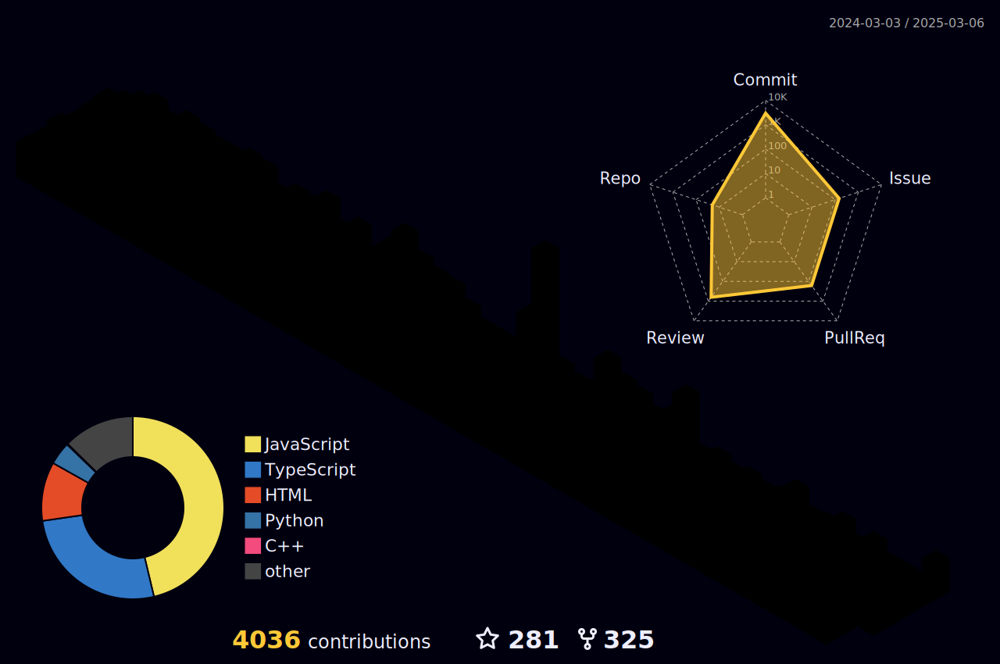

#  My GitHub Metrics

  
<strong>📊 Click to Expand Stats</strong>

    
  

  

  ## 🏆 GitHub Trophies  
  

    
  

  
## 📈 Contribution Graph

  

  ## 🔰 Holopin Badges  
  

    
  

<!-- ---------------------------------------STATS------------------------------------------
--------------------------------------------------------------------------------------------- -->      
        
          

       

<!-- ---------------------------------------3D Contributor------------------------------------------
--------------------------------------------------------------------------------------------- -->

<h1> CONTRIBUTIONS</h1>
 

        

  <!--- ------------------------------------------------------------------------------------------------------------------------------------------------------ -->
<!--- -- Snake Contribution Graph -------------------------------------------------------------------------------------------------------------------------- -->
<!--- ------------------------------------------------------------------------------------------------------------------------------------------------------ -->

  

<!-- CRAZY ANIMATIONS SECTION -->

  <h2>🎮 Thanks for visiting my profile! 🎮</h2>
  
  

    
  
  
  
   
  
  
  
  
  
  
  
  
  
    
  
  
  
  
  
   
  
  
  
   
  
  
  
   
  
  
  
    
  
  
  
  
  
    
  
  
  
    
  
  
  
  <h3>🔥 Keep Coding, Keep Innovating! 🔥</h3>

<!-- END OF CRAZY ANIMATIONS SECTION -->

