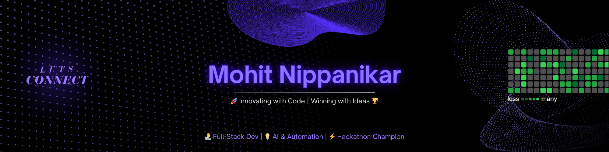
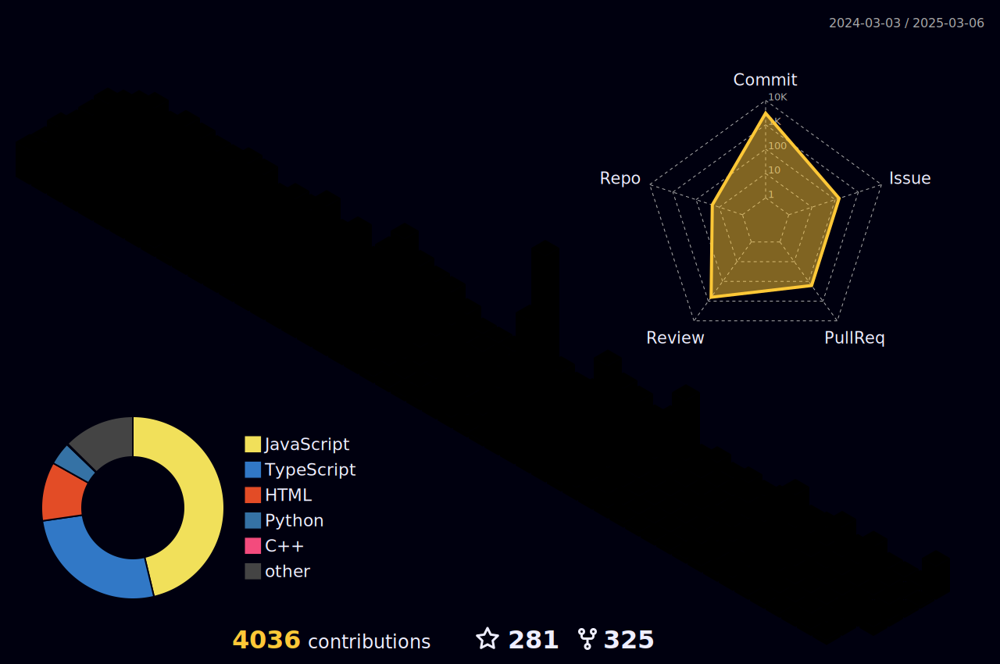

<!--- ------------------------------------------------------------------------------------------------------------------------------------------------------ -->
<!--- -- Custom Design Bannner ---------------------------------------------------------------------------------------------------------------------------- -->
<!--- ------------------------------------------------------------------------------------------------------------------------------------------------------ -->

<!--- ------------------------------------------------------------------------------------------------------------------------------------------------------ -->
<!--- -- Visitor Badge Links ----------------------------------------------------------------------------------------------------------------------------- -->
<!--- ------------------------------------------------------------------------------------------------------------------------------------------------------ -->

  
    
  
  
  
  
  
  <!--  -->
  <!--  -->

 

<!--- ------------------------------------------------------------------------------------------------------------------------------------------------------ -->
<!--- -- About ME  --------------------------------------------------------------------------------------------------------------------------------------- -->
<!--- ------------------------------------------------------------------------------------------------------------------------------------------------------ -->
 
 </a>
 

 Meaning of My name is Attractive. Yeah You are thinking Right I am Mohit Nippanikar. Intend to build a career with committed & dedicated people, who will help me to explore myself and understand my potential. Willing to work as a key player in challenging and creative environment with all my professional and technical skills.

### 
My Technical Skills

  

  

  

<i>&nbsp; Work with Optimism, Hope for the Best!</i>  

👋 Greetings! It's great to have you here. I'm Mohit Nippanikar, an enthusiastic Software Engineer hailing from India..

🚀 As the CoFounder of [Eveplora](https://www.eveplora.com/), Hackathons, Competitions, All at Your Fingertips. From global to local, discover every hackathon and competition in one place.

🎓 &nbsp; I'm pursuing Bachelor of Technology with a degree in Computer Science, and also maintaining CGPA of 9.45+ during all sems.

🔥 &nbsp; With an impressive following of 1.3k+ on [Linkedin](https://www.linkedin.com/in/mohitnippanikar/), I post a lot about my hackathon experiences and insights on how we can improve and excel in the tech industry through practical implementations and innovative approaches.

💡 &nbsp; Fueled by real-world challenges, I'm always exploring how technology can solve practical problems—driving solutions that bridge the gap between ideas and impactful outcomes.

🧭 &nbsp; Empathy is my compass—guiding collaboration, fostering understanding, and creating a harmonious tapestry in every interaction.

<!-- 

  
🏆 Certificates

   

📄 Below is a showcase of my knowledge and skills across a wide range of DevOps, cloud, and related technologies, primarily completed through [LinuxWorld Informatics Pvt. Ltd](https://www.linkedin.com/company/linuxworld-informatics-pvt-ltd).

 

| S.No. | Certificate Name | Issuing Authority | Date | Credential |
|:-----:|:-----------------|:------------------:|:----:|:----------:|
| 1. | JAZBAA 2.0 | LinuxWorld Informatics Pvt. Ltd. | August 2023 | [View](https://www.linkedin.com/posts/md-azfar-alam_iiec-jazbaa-20-certificate-of-participation-activity-7142721202652856320-PFFs?utm_source=share&utm_medium=member_desktop) |
| 2. | Summer Internship | LinuxWorld Informatics Pvt. Ltd. | September 2023 | [View](https://www.linkedin.com/posts/md-azfar-alam_summer-internship-certificate-activity-7108747092721905665-QnCj?utm_source=share&utm_medium=member_desktop) |
| 3. | ARTH 3.0 | LinuxWorld Informatics Pvt. Ltd. | November 2023 | [View](https://www.linkedin.com/posts/md-azfar-alam_arth-30-certificate-of-completion-activity-7241412508819808257-kagj?utm_source=share&utm_medium=member_desktop) |
| 4. | Industry Relevant AWS Training | LinuxWorld Informatics Pvt. Ltd. | May 2023 | [View](https://drive.google.com/file/d/1W3bKVgFCAL42-lmrM5qk1wbrs_zYkm-x/view?usp=sharing) |
| 5. | Jenkins CI/CD using Pipeline | LinuxWorld Informatics Pvt. Ltd. | January 2023 | [View](https://drive.google.com/file/d/17kxGNilfTU39liWtKt4un149HNzX78QY/view?usp=sharing) |
| 6. | Specialization in Container | LinuxWorld Informatics Pvt. Ltd. | April 2023 | [View](https://drive.google.com/file/d/1UkIQfQHMLSXLOeS_s8gFXm7cRoLNSZS5/view?usp=drive_link) |
| 7. | Bash Shell Scripting | LinuxWorld Informatics Pvt. Ltd. | January 2023 | [View](https://drive.google.com/file/d/10E7r8sRuxEO5Cb8yw_O5jTzddHCnEzvI/view?usp=drive_link) |
| 8. | MongoDB - NoSQL | LinuxWorld Informatics Pvt. Ltd. | April 2023 | [View](https://drive.google.com/file/d/1scEDURMvPz5K1CnCO8voyB2psHIO1P1c/view?usp=drive_link) |
| 9. | Monitoring using Prometheus & Grafana | LinuxWorld Informatics Pvt. Ltd. | May 2023 | [View](https://drive.google.com/file/d/1Zth5UR3RRePJ3phIHjvcxigZEbcVsUfK/view?usp=drive_link) |
| 10. | Managing Infrastructure using Terraform | LinuxWorld Informatics Pvt. Ltd. | February 2023 | [View](https://drive.google.com/file/d/1pyXT6jL1UIwyW2m8dLCtNs2mcELthOpi/view?usp=drive_link) |
| 11. | RHEL Automation with Ansible (294) | RedHat | December 2022 | [View](https://drive.google.com/file/d/16OB5BpfLHIomVgyDGVxkraTp9_VQ7YmH/view?usp=drive_link) |
| 12. | AWS Cloud with AI | LinuxWorld Informatics Pvt. Ltd. | August 2023 | [View](https://drive.google.com/file/d/1Obk4hSorYG2XjcTG2nPjk4W1_uiPIIrE/view?usp=sharing) |

  

 -->

 

## Latest Linkedin Posts  

 

<!-- BLOG-POST-LIST:START -->
- [𝐡𝐨𝐰 𝐚 𝐇𝐀𝐂𝐊𝐀𝐓𝐇𝐎𝐍 𝐬𝐡𝐨𝐮𝐥𝐝 𝐛𝐞 𝐥𝐢𝐤𝐞 ?? 😮🚀](https://www.linkedin.com/posts/mohitnippanikar_hackathon-dataanalytics-machinelearning-activity-7303422467677515776-DOob)
- [We won the Domain Winner title at Lines of Code 7.0! 🏆](https://www.linkedin.com/posts/mohitnippanikar_hackathon-ai-startup-activity-7300159266139574272-kTA-)
- [𝐇𝐨𝐰 𝐝𝐢𝐝 𝐚 𝟑-𝐦𝐨𝐧𝐭𝐡 𝐛𝐫𝐞𝐚𝐤 𝐡𝐞𝐥𝐩 𝐮𝐬 𝐰𝐢𝐧 𝐚 𝐡𝐚𝐜𝐤𝐚𝐭𝐡𝐨𝐧? 🤔](https://www.linkedin.com/posts/mohitnippanikar_hackathon-ai-ml-activity-7291112097726304258-UtuO)
- [This project helped us win the 𝐀𝐈/𝐌𝐋 𝐇𝐚𝐜𝐤𝐚𝐭𝐡𝐨𝐧!🤯](https://medium.com/@azfaralam/transforming-industries-the-power-of-natural-language-processing-nlp-in-the-age-of-ai-b159a0738344)
- [We built an 𝐞𝐱𝐜𝐞𝐩𝐭𝐢𝐨𝐧𝐚𝐥 𝐀𝐈 𝐩𝐫𝐨𝐣𝐞𝐜𝐭 but still didn't win the first prize.🤷](https://www.linkedin.com/posts/Mohit-Nippanikar78_hackathon-ai-ml-activity-7291106669537730560-OQYL)

<!-- BLOG-POST-LIST:END -->

<!------------------   -------------------------------------------------------------------- -->
<!---------------- Recommend Blog Post ----------------------------------------------------- -->
<!---------------------  ------------------------------------------------------------------- -->

<!------------------   -------------------------------------------------------------------- -->
<!----------------[END] Recommend Blog Post ----------------------------------------------------- -->
<!---------------------  ------------------------------------------------------------------- -->

<samp>Trying to touch and learn 1 new thing everyday!</samp>
---

# Tech Stack 

<samp>Tools & Technologies</samp> | <samp>Badge</samp> |
--- | --- |
<samp>DevOps</samp> |     
<samp>Cloud Platforms</samp> |   |
<samp>Operating System</samp> |     
<samp>Programming Languages</samp> |    
<samp>Frameworks</samp> |   |
<samp>IDE & Environment</samp> |     |
<samp>Version Control</samp> |   |
<samp>Databases</samp> |    |

 

<!--- ------------------------------------------------------------------------------------------------------------------------------------------------------ -->
<!--- -- Activity Graph ------------------------------------------------------------------------------------------------------------------------------------ -->
<!--- ------------------------------------------------------------------------------------------------------------------------------------------------------ -->

 

                     
 

<!--- ------------------------------------------------------------------------------------------------------------------------------------------------------ -->
<!--- -- Github Metrics & All ---------------------------------------------------------------------------------------------------------------------------------------- -->
<!--- ------------------------------------------------------------------------------------------------------------------------------------------------------ -->

#  My GitHub Metrics
 

  
<strong>📊 Click to Expand Stats</strong>

    
  

  

  ## 🏆 GitHub Trophies  
  

    
  

  
## 📈 Contribution Graph

  

  ## 🔰 Holopin Badges  
  

    
  

 
 
 

<!--- ------------------------------------------------------------------------------------------------------------------------------------------------------ -->
<!--- -- My Socials ---------------------------------------------------------------------------------------------------------------------------------------- -->
<!--- ------------------------------------------------------------------------------------------------------------------------------------------------------ -->

#  The Online Hangout

  
   
  
  

<!-- 
  

  

  -->

   

# Github Stats

<!-- ---------------------------------------STATS------------------------------------------
--------------------------------------------------------------------------------------------- -->

                

        
<!-- ---------------------------------------STATS------------------------------------------
--------------------------------------------------------------------------------------------- -->      
        
          

       

  

  
  
  
  <a href="https://github.com/Mohit-Nippanikar78">

  

<!-- ---------------------------------------3D Contributor------------------------------------------
--------------------------------------------------------------------------------------------- -->

<h1>CONTRIBUTIONS</h1>
 

        

  <!--- ------------------------------------------------------------------------------------------------------------------------------------------------------ -->
<!--- -- Snake Contribution Graph -------------------------------------------------------------------------------------------------------------------------- -->
<!--- ------------------------------------------------------------------------------------------------------------------------------------------------------ -->

  
  
  

<!-- END OF CRAZY ANIMATIONS SECTION -->

